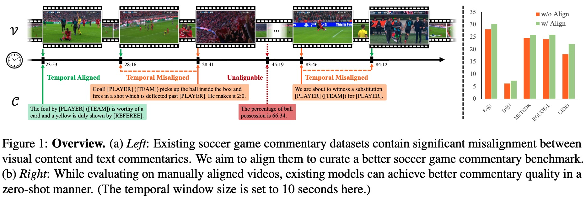
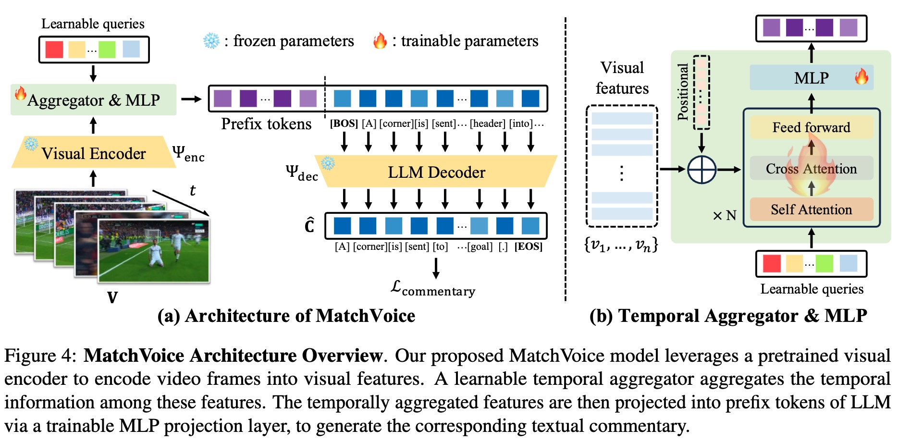

# MatchTime: Towards Automatic Soccer Game Commentary Generation
This repository contains the official PyTorch implementation of MatchTime: https://arxiv.org/abs/2406.18530/

<div align="center">
   
</div>

<div align="center">
   
</div>

## Some Information
[Project Page](https://haoningwu3639.github.io/MatchTime/)  $\cdot$ [Paper](https://arxiv.org/abs/2406.18530/) $\cdot$ [Dataset](https://drive.google.com/drive/folders/14tb6lV2nlTxn3VygwAPdmtKm7v0Ss8wG) $\cdot$ [Checkpoint](https://huggingface.co/Homie0609/MatchVoice)

## Requirements
- Python >= 3.8 (Recommend to use [Anaconda](https://www.anaconda.com/download/#linux) or [Miniconda](https://docs.conda.io/en/latest/miniconda.html))
- [PyTorch >= 2.0.0](https://pytorch.org/) (If use A100)

A suitable [conda](https://conda.io/) environment named `matchtime` can be created and activated with:
```
cd MatchTime
conda env create -f environment.yaml
conda activate matchtime
```

## Training

Before training, make sure you have prepared [features](https://pypi.org/project/SoccerNet/) and caption [data]((https://drive.google.com/drive/folders/14tb6lV2nlTxn3VygwAPdmtKm7v0Ss8wG)), and put them into according folders. The structure after collating should be like:
``````
└─ MatchTime
    ├─ dataset
    │     ├─ MatchTime
    │     │   ├─ valid
    │     │   └─ train
    │     │       ├─ england_epl_2014-2015
    │     │      ...     ├─ 2015-02-21 - 18-00 Chelsea 1 - 1 Burnley
    │     │             ...    └─ Labels-caption.json
    │     │
    │     ├─ SN-Caption
    │     └─ SN-Caption-test-align
    │         ├─ england_epl_2015-2016 
    │        ...  ├─ 2015-08-16 - 18-00 Manchester City 3 - 0 Chelsea
    │            ...           └─ Labels-caption_with_gt.json
    │
    ├─ features
    │     ├─ baidu_soccer_embeddings
    │     │   ├─ england_epl_2014-2015 
   ...    │  ...  ├─ 2015-02-21 - 18-00 Chelsea 1 - 1 Burnley
          │      ...     ├─ 1_baidu_soccer_embeddings.npy
          │              └─ 2_baidu_soccer_embeddings.npy
          ├─ C3D_PCA512
         ...
``````
with the format of features is adjusted by
```
python ./features/preprocess.py directory_path_of_feature
```
After preparing the data and features, you can pre-train (or finetune) with the following terminal command (Check hyper-parameters at the bottom of *train.py*):
```
python train.py
```
## Inference

We provide two types of inference:

#### For all test set

You can generate a *.csv* file with the following code to test the ***MatchVoice*** model with the following code (Check hyper-parameters at the bottom of *inference.py*)

```
python inference.py
```

There is a sample of this type of inference in *./inference_result/sample.csv*.

#### For Single Video

We also provide a version for predict the commentary single video (for our checkpoints, use 30s video)
```
python inference_single_video_CLIP.py single_video_path
```
Here we only provide the version of CLIP feature (using VIT/B-32), for crop the CLIP feature, please check [here](https://github.com/openai/CLIP).

## TODO
- [ ] Release Demo
- [ ] Model & Training & Inference Code
- [ ] Dataset Processing Pipeline
- [ ] Meta Data
- [ ] Release Checkpoints

## Citation
If you use this code for your research or project, please cite:

	@arxiv{rao2024matchtimeautomaticsoccergame,
      title={MatchTime: Towards Automatic Soccer Game Commentary Generation}, 
      author={Jiayuan Rao and Haoning Wu and Chang Liu and Yanfeng Wang and Weidi Xie},
      year={2024},
      journal={arXiv preprint arXiv:2406.18530},
      }

## Acknowledgements
Many thanks to the code bases from [Video-LLaMA](https://github.com/DAMO-NLP-SG/Video-LLaMA) and source data from [SoccerNet-Caption](https://arxiv.org/abs/2304.04565).

## Contact
If you have any questions, please feel free to contact jy_rao@sjtu.edu.cn or haoningwu3639@gmail.com.